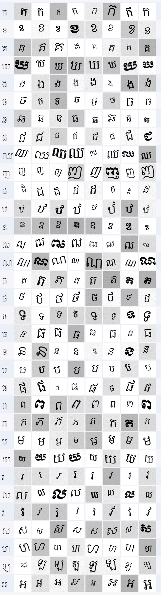

# Khmer Consonant Dataset Generator

Generates a synthetic image dataset of all **33 Khmer consonants** for training handwriting recognition models. Works on **Windows, macOS, and Linux** with no system configuration — all fonts are bundled in the `fonts/` folder.

---

## Showcase

A visual sample of generated images. The preview grid is saved as `preview_grid.png` when you run `python generate.py --preview`.



## Folder Structure

```
dataset/
├── fonts/                 ← Khmer fonts committed to the repo (~7 MB)
│   ├── KhmerOS.ttf
│   ├── KhmerOSbattambang.ttf
│   └── ...  (17 fonts total)
├── fonts.yaml             ← font registry: names, licenses, download URLs
├── constants.py           ← loads fonts.yaml, defines consonants + settings
├── augment.py             ← augmentation functions (rotate, noise, blur …)
├── renderer.py            ← renders a Unicode character onto a canvas
├── generator.py           ← builds dataset folders + preview grid
├── generate.py            ← CLI entry point — run this
├── setup.py               ← checks environment + downloads missing fonts
└── README.md
```

---

## How to Run

### Step 1 — Clone the repo


### Step 2 — Install Python dependencies


```bash
uv sync
```

### Step 3 — Run setup

```bash
uv run setup.py
```


If any fonts are missing for any reason, `setup.py` downloads them automatically from the URLs in `fonts.yaml`.

### Step 4 — Generate the dataset

```bash
# Quick test — 100 images per class (3,300 total) + preview grid
python generate.py --samples 100 --preview

# Larger dataset for better model accuracy
python generate.py --samples 300 --preview

# Recommended for Kaggle / Colab training
python generate.py --samples 500 --output ./data/khmer_consonants
```

---

## All CLI Options

```
python generate.py [options]
```

| Flag               | Default                     | Description                                    |
| ------------------ | --------------------------- | ---------------------------------------------- |
| `--output` / `-o`  | `./khmer_consonant_dataset` | Where to write the dataset                     |
| `--samples` / `-s` | `100`                       | Images per class                               |
| `--size`           | `64`                        | Image resolution in pixels (square)            |
| `--train-ratio`    | `0.8`                       | Fraction of images for training (rest → val)   |
| `--no-split`       | off                         | Skip train/val split, put all images in `all/` |
| `--preview`        | off                         | Save a `preview_grid.png`                      |
| `--seed`           | `42`                        | Random seed for reproducibility                |

---

## How Fonts Work

Fonts live in `fonts/` and are listed in `fonts.yaml`. `constants.py` reads `fonts.yaml` at import time and resolves each filename to an absolute path using `Path(__file__).parent` — so paths never depend on the OS, the working directory, or system font installation.

**To add a font:**
1. Drop the `.ttf` or `.otf` file into `fonts/`
2. Add an entry to `fonts.yaml`

No code changes needed.

**`fonts.yaml` entry format:**
```yaml
- file:         KhmerOS.ttf         # filename in fonts/
  family:       KhmerOS             # human-readable name
  style:        Regular             # Regular / Bold / Italic
  license:      GPL-2.0             # SPDX identifier
  download_url: https://...         # used by setup.py if file is missing
```

---

## Output Structure

```
khmer_consonant_dataset/
├── train/
│   ├── ka/              ← consonant ក (40 images at 80/20 split)
│   │   ├── ka_0000.png
│   │   └── ...
│   ├── kha/
│   └── ...  (33 folders)
├── val/
│   └── ...
├── dataset_info.json    ← label map, font list, per-class stats
└── preview_grid.png     ← visual sample of all classes (with --preview)
```


## Loading in a Training Notebook

The output uses the standard `ImageFolder` layout (one subfolder per class):

**PyTorch:**
```python
from torchvision import datasets, transforms

transform = transforms.Compose([
    transforms.Grayscale(),
    transforms.ToTensor(),
    transforms.Normalize((0.5,), (0.5,)),
])

train_data = datasets.ImageFolder("khmer_consonant_dataset/train", transform=transform)
val_data   = datasets.ImageFolder("khmer_consonant_dataset/val",   transform=transform)
```

**TensorFlow / Keras:**
```python
import tensorflow as tf

train_data = tf.keras.utils.image_dataset_from_directory(
    "khmer_consonant_dataset/train",
    color_mode="grayscale",
    image_size=(64, 64),
    batch_size=32,
)
```

---

## How It Works

### `fonts.yaml` — Font registry
Lists every bundled font. `setup.py` reads this to download missing fonts. `constants.py` reads this to find font paths at runtime. Adding a font only requires editing this file.

### `constants.py` — Shared config
Loads `fonts.yaml` and builds absolute font paths relative to the file's own location (`Path(__file__).parent`). Also defines the consonant list, label map, and image settings. All other modules import from here.

### `renderer.py` — Character rendering
`render_character()` draws one character centered on a white canvas. `is_visible()` checks there are enough dark pixels — guards against fonts that silently skip missing glyphs.

### `augment.py` — Augmentation pipeline
Six transforms simulate handwriting variation. Each is a standalone function; `apply_all()` chains them.

| Function         | Effect                         |
| ---------------- | ------------------------------ |
| `rotate`         | Random tilt ±15°               |
| `scale`          | Resize 75–115%, re-centered    |
| `shift`          | Translate ±8 px                |
| `shear`          | Horizontal slant (pen angle)   |
| `blur`           | Gaussian blur, 50% probability |
| `gaussian_noise` | Pixel noise σ=12               |
| `brightness`     | Factor 0.7–1.3×                |

### `generator.py` — Dataset builder
`generate_dataset()` loops over all consonants, renders + augments each sample, splits into train/val, and saves PNGs. Also writes `dataset_info.json`. `save_preview_grid()` builds the visual sample grid.

### `generate.py` — CLI entry point
Only 40 lines. Parses CLI args and calls `generate_dataset()`. Kept thin so `generator.py` is importable directly from notebooks.

### `setup.py` — Environment checker
Verifies Python version, packages, and fonts. Downloads missing fonts from `download_url` entries in `fonts.yaml`. Falls back gracefully with manual installation instructions if a download fails.

---

## Bundled Fonts

| Family           | Styles                                                                                                     | License |
| ---------------- | ---------------------------------------------------------------------------------------------------------- | ------- |
| KhmerOS          | Regular, System, Battambang, Bokor, Content, Fasthand, Freehand, Metal Chrieng, Muol, Muol Light, Siemreap | GPL-2.0 |
| Khmer Mondulkiri | Regular, Bold, Italic                                                                                      | OFL-1.1 |
| Khmer Busra      | Regular, Bold, Italic                                                                                      | OFL-1.1 |

Both GPL-2.0 and OFL-1.1 allow free use, redistribution, and inclusion in open-source projects.

---

## The 33 Khmer Consonants

| #   | Char | Label | #   | Char | Label | #   | Char | Label |
| --- | ---- | ----- | --- | ---- | ----- | --- | ---- | ----- |
| 1   | ក    | ka    | 12  | ឋ    | tha   | 23  | ព    | po    |
| 2   | ខ    | kha   | 13  | ឌ    | do    | 24  | ភ    | pho   |
| 3   | គ    | ko    | 14  | ឍ    | dho   | 25  | ម    | mo    |
| 4   | ឃ    | kho   | 15  | ណ    | na    | 26  | យ    | yo    |
| 5   | ង    | ngo   | 16  | ត    | ta    | 27  | រ    | ro    |
| 6   | ច    | cha   | 17  | ថ    | tha2  | 28  | ល    | lo    |
| 7   | ឆ    | chha  | 18  | ទ    | to    | 29  | វ    | vo    |
| 8   | ជ    | cho   | 19  | ធ    | tho   | 30  | ស    | so    |
| 9   | ឈ    | chho  | 20  | ន    | no    | 31  | ហ    | ho    |
| 10  | ញ    | nyo   | 21  | ប    | ba    | 32  | ឡ    | la    |
| 11  | ដ    | da    | 22  | ផ    | pha   | 33  | អ    | a     |